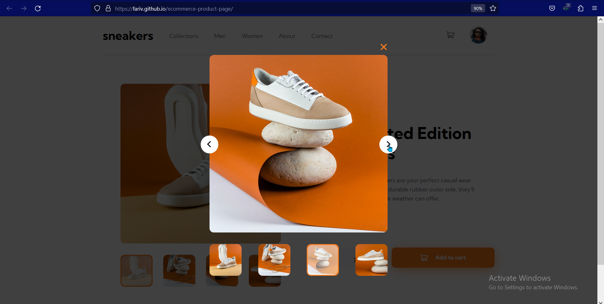

# Frontend Mentor - E-commerce product page solution

This is a solution to the [E-commerce product page challenge on Frontend Mentor](https://www.frontendmentor.io/challenges/ecommerce-product-page-UPsZ9MJp6). Frontend Mentor challenges help you improve your coding skills by building realistic projects.

## Table of contents

- [Overview](#overview)
  - [The challenge](#the-challenge)
  - [Screenshot](#screenshot)
  - [Links](#links)
- [My process](#my-process)
  - [Built with](#built-with)
  - [What I learned](#what-i-learned)
- [Author](#author)

## Overview

### The challenge

Users should be able to:

- View the optimal layout for the site depending on their device's screen size
- See hover states for all interactive elements on the page
- Open a lightbox gallery by clicking on the large product image
- Switch the large product image by clicking on the small thumbnail images
- Add items to the cart
- View the cart and remove items from it

### Screenshot





### Links

- Live Site URL: [Ecommerce Product Page](https://fariv.github.io/ecommerce-product-page/)

## My process

### Built with

- Semantic HTML5 markup
- CSS custom properties
- Flexbox
- [React](https://reactjs.org/) - JS library
- [Styled Components](https://styled-components.com/) - For styles

### What I learned

Here I used Context API heavily for state management

```js
function App() {
    const [showBackdrop, setShowBackdrop] = useState(0);
    const [popupEl, setPopupEl] = useState([]);
    const [isSideMenuOpened, setIsSideMenuOpened] = useState(0);
    return (
        <>
            <PopupContext.Provider value={{
                    showBackdrop, 
                    setShowBackdrop,
                    popupEl, 
                    setPopupEl,
                    isSideMenuOpened,
                    setIsSideMenuOpened,
                }}
            >
                <PageContainer />
                <Backdrop />
                {popupEl}
            </PopupContext.Provider>
        </>
    )
}
```

## Author

- Frontend Mentor - [@Fariv](https://www.frontendmentor.io/profile/fariv)
- Twitter - [Ashraful Ferdous](https://www.linkedin.com/in/ashraful-ferdous-190652119/)
